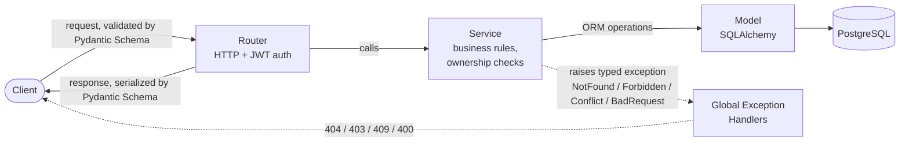
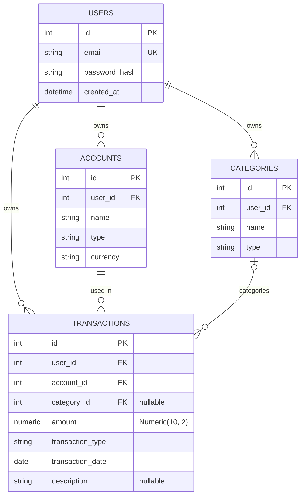

# Personal Finance API

A production-style backend API for personal finance management — built to
practice real-world backend engineering patterns: layered architecture,
authentication and authorization, testing, CI/CD, containerization, and
cloud deployment.

[](https://github.com/opas1216/personal-finance-api/actions/workflows/ci.yml)

**Live demo (interactive API docs):** https://personal-finance-api-0tcv.onrender.com/docs

> Hosted on Render's free tier — the first request after a period of
> inactivity may take ~30s to wake up.

## Purpose

This project is designed to:

- Learn backend engineering fundamentals
- Build a portfolio-quality backend project
- Prepare for backend engineer opportunities in Japan

## Features

- **Authentication**: register/login with JWT (bearer tokens)
- **Accounts**: CRUD, JWT-protected, ownership-validated (a user can only
  access their own accounts)
- **Categories**: CRUD, same protection model as accounts
- **Transactions**: CRUD with filtering and pagination
- **Reports**: monthly income/expense summary, category-level summary
  (SQLAlchemy aggregation and joins)
- **Error handling**: custom exception hierarchy mapped to proper HTTP
  status codes via global exception handlers
- **Testing**: 25 automated tests (pytest), run on every push via CI
- **Containerized**: Dockerfile and docker-compose for local development
- **Deployed**: live on Render, auto-migrates on container start

## Tech Stack

| Layer | Choice | Why |
|---|---|---|
| Framework | FastAPI | API-only service — Pydantic-based validation doubles as auto-generated OpenAPI docs (see `/docs` above), no need for a heavier full-stack framework like Django |
| Database | PostgreSQL | Data is inherently relational (users to accounts to categories to transactions, joined for reports) — needed real relational integrity, not a document store |
| ORM / Migrations | SQLAlchemy + Alembic | Standard Python ORM; Alembic gives version-controlled, reproducible schema changes instead of hand-run SQL |
| Validation | Pydantic v2 | Request/response schemas, type-safe by default |
| Testing | Pytest | Fixture-based, less boilerplate than `unittest` |
| Containerization | Docker / docker-compose | Consistent environment across dev machines, CI, and production — solved real "works on my machine" issues hit during development (see below) |
| CI | GitHub Actions | Already hosting the code on GitHub — no extra service to wire up |
| Deployment | Render | Free tier, GitHub-connected auto-deploy, reuses the existing Dockerfile with no extra config |

## Architecture

Requests flow through three layers with a strict responsibility split:



- **Router**: parses the request, resolves auth (`Depends(get_current_user)`),
  calls a service, returns the response. No business logic.
- **Service**: business rules (e.g. amount must be positive), ownership
  validation (a user cannot touch another user's data — raises
  `ForbiddenException`), coordinates the DB session.
- **Model**: SQLAlchemy classes — table structure only.
- **Schema**: Pydantic classes — defines exactly what a client can send in
  and what gets sent back out.

Errors are raised as typed exceptions (`app/exceptions.py`) and translated
to HTTP responses by global handlers in `app/main.py` (`NotFoundException`
to 404, `ForbiddenException` to 403, `ConflictException` to 409,
`BadRequestException` to 400) — routers and services never build HTTP
responses directly.

## Database Schema (ERD)



Every table other than `users` carries its own `user_id` foreign key
directly (not just inherited transitively through `accounts`), which is
exactly what makes the per-row ownership checks in the service layer
possible — each row always knows who it belongs to.

## Getting Started

### Option A — fully containerized

```bash
git clone https://github.com/opas1216/personal-finance-api.git
cd personal-finance-api
cp .env.example .env
# fill in your own values in .env
docker-compose up
```

### Option B — Postgres in Docker, app running locally (faster dev loop / debugging)

```bash
docker-compose up db
python -m venv .venv
.venv/Scripts/activate
pip install -r requirements.txt
alembic upgrade head
uvicorn app.main:app --reload
```

Either way, the API is available at `http://localhost:8000`, docs at
`http://localhost:8000/docs`.

### Running tests

```bash
pytest
```

## API Documentation

Interactive docs are auto-generated from the code, so they never go stale:

- Swagger UI: `/docs`
- ReDoc: `/redoc`

## What I Learned

This project was also how I learned most of these concepts in the first
place — pytest, fixtures, authentication vs authorization, HTTP semantics,
ORM internals, and CI/CD were all new to me going in. Below are the ones
that stuck, grounded in specific bugs and decisions from this build rather
than textbook definitions.

### Authentication vs Authorization

These sound similar but answer different questions, and this project had a
real bug that came from conflating them:

- **Authentication** asks "who are you / are you logged in" — enforced by
  `Depends(get_current_user)`, which validates the JWT and resolves it to a
  user. Failure is `401`.
- **Authorization** asks "are you allowed to touch *this specific*
  resource" — a question you can only ask *after* authentication has
  already answered "who are you." Failure is `403`.

I found and fixed a real gap in this project caused by only implementing
the first one: `get_one`/`update`/`delete` on accounts and categories
required a valid JWT (authentication OK) but never checked whether the
resource actually belonged to the logged-in user (authorization missing) —
any logged-in user could read, edit, or delete *another* user's data. The
fix was adding an explicit ownership check in the service layer
(`if resource.user_id != current_user.id: raise ForbiddenException(...)`),
not in the router — business rules belong in the service, not the HTTP
layer.

I also learned that FastAPI resolves security dependencies *before*
validating the request body — so a request that is both unauthenticated
*and* has an invalid body returns `401`, not `422`. The auth check
short-circuits first.

### Testing & Pytest Fixtures

- A **fixture** isn't just "setup code with a decorator" — fixtures form a
  dependency graph. If fixture `B` declares fixture `A` as a parameter,
  any test requesting `B` automatically gets `A` resolved too; you don't
  need to redundantly list `A` in the test's own signature. Pytest also
  caches each fixture's result per test call, so requesting the same
  fixture from two places in one test still only runs it once.
- Where to put an `assert` inside a fixture depends on what role that
  fixture plays for a given test:
  - If the fixture is only a **precondition** (e.g. creating an account so
    a transaction test has something to attach a transaction to — the
    correctness of account creation is already covered by its own test
    elsewhere), it should assert its own success. That way a broken
    precondition fails loudly and clearly, instead of surfacing three
    fixtures later as a confusing `KeyError`.
  - If the fixture *is* the thing a specific test exists to verify (e.g. a
    `generate_transaction` fixture used by `test_create_transaction`), it
    should **not** assert anything internally — otherwise the test
    function becomes an empty shell that just re-checks what the fixture
    already checked, and loses its own reason to exist.
- `assert condition, message` only ever evaluates and uses `message` when
  `condition` is falsy — on success it does nothing, so the message
  expression is free to make expensive/detailed on a passing run.
- A `TestClient` response object is not a dict — `response["field"]` raises
  `TypeError: 'Response' object is not subscriptable`; you need
  `response.json()["field"]` to parse the body first.
- Query params, path params, and JSON bodies are three distinct HTTP
  mechanisms, and the test client models them differently
  (`client.get(url, params={...})` vs `client.post(url, json={...})`) —
  `TestClient.get()` doesn't even accept a `json=` kwarg.
- Comparing serialized money fields as raw strings is brittle
  (`"100.0" != "100.00"` even though they're equal as numbers) — compare
  as `Decimal(a) == Decimal(b)` on both sides instead.

### SQLAlchemy / ORM Internals

- `Base.metadata` (the in-memory schema "blueprint" of every model) has
  nothing to do with whether the *database* is fresh — it's rebuilt from
  scratch every time the process starts, purely as a side effect of
  Python importing the model files (the `class Account(Base): ...`
  statement itself registers the table into `Base.metadata` the moment
  it's executed). It's not something that persists across restarts; the
  `.py` source files are what persists, and re-importing them rebuilds the
  same metadata every time.
- An `engine` and a `Session` are different things: the `engine` just
  knows *how* to connect to one specific database (holds the connection
  pool); a `Session` is the actual unit-of-work object used to run
  queries, track changed objects, and manage a transaction. A session's
  natural scope is "one logical piece of work" (this project scopes it to
  one HTTP request via `get_db()`), not "one type of database operation" —
  a single session can do many different queries/inserts/updates within
  the same transaction.

### API / HTTP Design

- FastAPI infers whether a function parameter is a path param, query
  param, or request body from *how it's declared*, not from explicit
  configuration: appears inside `{}` in the route path -> path param; a
  plain scalar parameter not in the path -> query param; a Pydantic model
  type -> request body.
- `/docs` (Swagger UI) and `/redoc` are generated entirely automatically
  from the route definitions and Pydantic schemas — there's no
  hand-written API documentation to let go stale.

### CI/CD & Deployment

- Docker's `CMD` has two forms with very different behavior. Exec form
  (`CMD ["cmd", "arg"]`) never invokes a shell, so shell operators like
  `&&` inside the array are passed through as a literal, meaningless
  argument — `alembic` received `&&` as an invalid CLI flag and errored
  out, and `uvicorn` never ran at all. Shell form (`CMD cmd && cmd2`, no
  brackets) is required for `&&` to actually chain two commands. Verified
  the fix with a real Postgres container locally before trusting it in
  production.
- `create_engine(DATABASE_URL)` in `app/database.py` is a **module-level**
  statement, so it runs the instant the module is imported — not when a
  request comes in. CI has no `.env` file, so `DATABASE_URL` was `None`
  and crashed pytest's *collection* phase before a single test could run.
  Fixed with a syntactically-valid-but-unreachable fake URL in CI, since
  tests override the DB dependency entirely and never touch the real
  engine.
- A **webhook** is an event-driven notification, the reverse of polling:
  instead of Render repeatedly asking GitHub "anything new?", GitHub calls
  a URL Render registered the moment a `push` happens. This is how
  Render's auto-deploy actually works.
- CI and CD aren't automatically chained just because both exist. Without
  a pull-request-gated workflow, pushing straight to `main` triggers the
  GitHub Actions test job *and* Render's deploy webhook independently and
  in parallel — a broken test suite doesn't block a broken version from
  reaching production unless that dependency is deliberately wired
  (branch protection requiring CI to pass before merge, or a deploy hook
  fired only after CI succeeds).
- A failed deploy on a platform like Render doesn't take the running
  service down — the previous successful deploy keeps serving traffic
  until a new one both builds and passes health checks.

## Project Structure

```
app/
  main.py        # FastAPI app, global exception handlers
  database.py    # engine, session, Base
  models/        # SQLAlchemy models (DB structure only)
  schemas/       # Pydantic request/response schemas
  routers/       # HTTP layer, one file per resource
  services/      # business logic, ownership validation
alembic/         # DB migrations
tests/           # pytest suite
```

## Project Documents

- [PROJECT_SCOPE.md](PROJECT_SCOPE.md) — MVP feature scope and DB schema
- [ROADMAP.md](ROADMAP.md) — the 12-week build plan
- [PROGRESS.md](PROGRESS.md) — detailed build notes and gotchas learned along the way
- [INTERVIEW_NOTES.md](INTERVIEW_NOTES.md) — practice Q&A on this project's design decisions and bugs
- [CLAUDE.md](CLAUDE.md) — architecture rules and development conventions
